<div align="center">


<h1>Identity Security Scorecard</h1>

<p><strong>The Institutional-Grade Platform for Quantitative Risk Measurement, Security Posture Scoring, and Zero-Trust Maturity Benchmarking.</strong></p>

[]()
[]()
[]()

<br/>

> **"You cannot manage what you cannot measure."** 
> **Identity Security Scorecard** is an enterprise-grade platform designed to provide a secure, measurable, and highly automated foundation for global identity operations. It orchestrates the complex lifecycle of security posture—from multi-cloud identity assessment and weighted risk scoring to industry benchmarking and unified executive ROI governance.

</div>

---

## 🏛️ Executive Summary

Fragmented identity metrics and manual posture evaluations are strategic operational liabilities; lack of centralized risk orchestration is a primary barrier to organizational Zero Trust maturity. Organizations fail to maintain a secure identity posture not because of a lack of tools, but because of fragmented scoring standards, lack of automated risk validation, and an inability to orchestrate identity landing zones with operational precision.

This platform provides the **Posture Intelligence Plane**. It implements a complete **Enterprise Scorecard-as-Code Framework**, enabling Security and Compliance teams to manage global identity risk as first-class citizens. By automating the identification of security gaps through real-time telemetry analysis and orchestrating the benchmarking against industry-standard maturity models, we ensure that every organizational identity—from core directory admins to routine application users—is measured by default, audited for history, and strictly aligned with institutional security frameworks.

---

## 📐 Architecture Storytelling: Principal Reference Models

### 1. Principal Architecture: Global Identity Security Scorecard & Posture Intelligence Plane
This diagram illustrates the end-to-end flow from multi-cloud identity assessment and weighted scoring to industry benchmarking, remediation planning, and institutional posture auditing.

```mermaid
graph LR
    %% Subgraph Definitions
    subgraph IdentityIngress["Multi-Cloud & IdP Ingress"]
        direction TB
        Cloud_IdPs["Entra ID / Okta / Ping Signals"]
        Access_Telemetry["AuthN & AuthZ Patterns"]
        Config_States["IAM Policy & Role Configs"]
    end

    subgraph IntelligenceEngine["Posture Intelligence Hub"]
        direction TB
        API["FastAPI Scorecard Gateway"]
        ScoringEngine["Weighted Risk Decision Hub"]
        BenchmarkingOrch["Industry & Peer Compare Orch"]
        RemediationHub["Remediation & ROI Hub"]
    end

    subgraph OperationsPlane["Distributed Posture Fleet"]
        direction TB
        PostureScanners["AIOps Hygiene Pattern Scanners"]
        MFA_Validators["Auth Strength Compliance Enforcers"]
        DiscoveryProxies["Privileged Access Discovery Proxies"]
    end

    subgraph OperationsHub["Institutional Posture Hub"]
        direction TB
        Scorecard["Identity Maturity Score"]
        Analytics["Remediation & Drift Stats"]
        Audit["Forensic Posture Metadata Lake"]
    end

    subgraph DevOps["Scorecard-as-Code Framework"]
        direction TB
        TF["Terraform Scorecard Modules"]
        DriftBot["Posture Configuration Drift Validator"]
        ChatOps["Executive Reporting Hub"]
    end

    %% Flow Arrows
    IdentityIngress -->|1. Submit Identity Data| API
    API -->|2. Execute Scoring| ScoringEngine
    ScoringEngine -->|3. Compare Benchmarks| BenchmarkingOrch
    BenchmarkingOrch -->|4. Calculate ROI| RemediationHub
    
    RemediationHub -->|5. Execute Validation| OperationsPlane
    OperationsPlane -->|6. Notify Status| ChatOps
    API -->|7. Visualize Health| Scorecard
    
    Scorecard -->|8. Track Risk| Analytics
    Scorecard -->|9. Record Score| Audit
    
    TF -->|10. Provision Hub| IntelligenceEngine
    DriftBot -->|11. Inject Posture Risk| ScoringEngine
    Audit -->|12. Improve Score| PostureScanners

    %% Styling
    classDef ingress fill:#f5f5f5,stroke:#616161,stroke-width:2px;
    classDef intel fill:#e8eaf6,stroke:#1a237e,stroke-width:2px;
    classDef operations fill:#e1f5fe,stroke:#01579b,stroke-width:2px;
    classDef ops fill:#ede7f6,stroke:#311b92,stroke-width:2px;
    classDef devops fill:#e8f5e9,stroke:#1b5e20,stroke-width:2px;

    class IdentityIngress ingress;
    class IntelligenceEngine intel;
    class OperationsPlane operations;
    class OperationsHub ops;
    class DevOps devops;
```

### 2. The Scorecard Lifecycle Flow
The continuous path of an identity security scorecard from initial assessment (posture) and scoring (risk) to active benchmarking, remediation planning, and institutional forensic auditing.

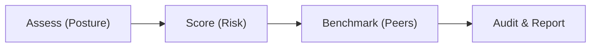

### 3. Distributed Identity Posture Topology
Strategically measuring identity security across global geographic clusters and multi-cloud IdPs, providing a unified institutional view of global identity health and risk coverage.

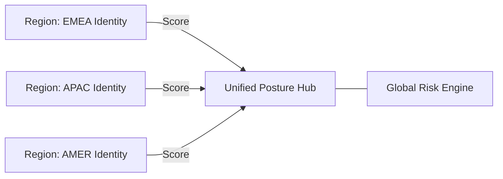

### 4. MFA & Auth Security Grading Flow
Executing complex logic for evaluating the strength of authentication methods—including Phish-Resistant, FIDO2, and Legacy MFA—ensuring every organizational login is verified against institutional security standards.

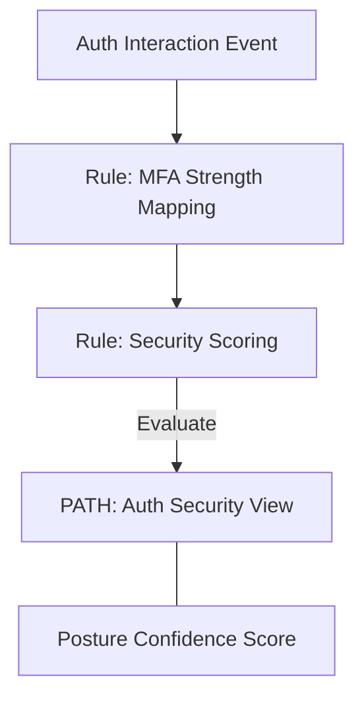

### 5. Privileged Access & Shadow Admin Discovery Flow
Automatically identifying excessive permissions, shadow admins, and privileged entitlement sprawl across Cloud IAM and Active Directory, ensuring institutional audit readiness by default.

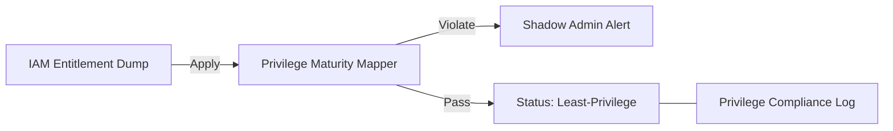

### 6. Executive Reporting & ROI Realization Flow
Managing the lifecycle of a security investment, automatically calculating risk reduction and potential insurance premium impact from identity security improvements, ensuring zero-latency value reporting.

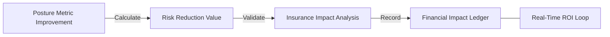

### 7. Institutional Identity Maturity Scorecard
Grading organizational performance based on key indicators: MFA Adoption Rate, JIT Access Usage, and Threat Remediation Speed Index.

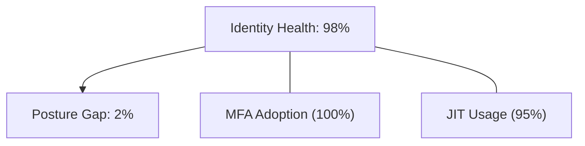

### 8. Identity & RBAC for Scorecard Governance
Managing fine-grained access to scorecard hubs, posture scanners, and audit logs between Identity Architects, Security Compliance, and Executive Stakeholders.

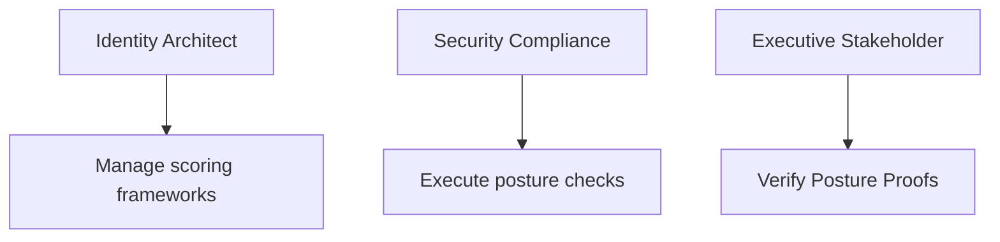

### 9. IaC Deployment: Scorecard-as-Code Framework
Using modular Terraform to deploy and manage the versioned distribution of the scorecard tracking hubs, posture scanners, and forensic metadata lakes.

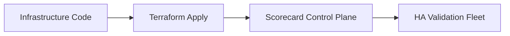

### 10. AIOps Posture Drift & Risk Validation Flow
Using advanced analytics to identify sudden drops in identity security scores, suspicious configuration drifts, or unusual risk pattern changes that could result in institutional risk.

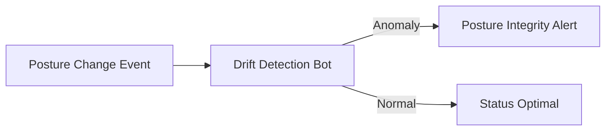

### 11. Metadata Lake for Forensic Posture Audit
Storing long-term records of every posture scan, every score change recorded, and every remediation verification for institutional record-keeping, compliance auditing, and post-assessment forensics.

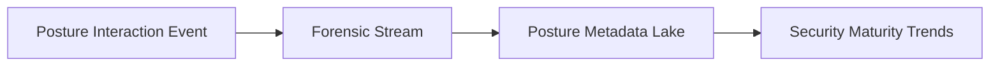

---

## 🏛️ Core Posture Pillars

1.  **Unified Posture Coordination**: Maximizing resilience by centralizing all identity measurement through a single institutional plane.
2.  **Automated Risk Quantification**: Eliminating "subjective assessment" scenarios through proactive scoring and pattern verification.
3.  **Sequential Improvement Intelligence**: Ensuring zero-interruption operations through dependency-aware multi-stage remediations.
4.  **Zero-Trust Posture Protection**: Automatically enforcing least-privilege assessment and rule evaluation across all posture tiers.
5.  **Autonomous Assessment Logic**: Guaranteeing reliability through automated industry-specific identity monitoring runbooks.
6.  **Full Posture Auditability**: Immutable recording of every score change and remediation action for institutional forensics.

---

## 🛠️ Technical Stack & Implementation

### Scorecard Engine & APIs
*   **Framework**: Python 3.11+ / FastAPI.
*   **Scoring Hub**: Custom Python-based logic for weighted risk calculation and DORA-style identity metrics.
*   **Integrations**: Native connectors for Entra ID, Okta, Ping, and Cloud IAM APIs.
*   **Persistence**: PostgreSQL (Scorecard Ledger) and Redis (Live Posture State).
*   **Auth Orchestrator**: Federated OIDC/SAML for least-privilege identity management access.

### Governance Dashboard (UI)
*   **Framework**: React 18 / Vite.
*   **Theme**: Dark, Indigo, Slate (Modern high-fidelity metrics aesthetic).
*   **Visualization**: D3.js for posture topologies and Recharts for risk velocity analytics.

### Infrastructure & DevOps
*   **Runtime**: AWS EKS or Azure Kubernetes Service (AKS) for management plane.
*   **Posture Hub**: Managed event sourcing for immutable identity security timeline reconstruction.
*   **IaC**: Modular Terraform for deploying the scorecard landing zone and validation fleet.

---

## 🏗️ IaC Mapping (Module Structure)

| Module | Purpose | Real Services |
| :--- | :--- | :--- |
| **`infrastructure/score_hub`** | Central management plane | EKS, PostgreSQL, Redis |
| **`infrastructure/scanners`** | Distributed posture fleet | K8s Workers, Cloud APIs |
| **`infrastructure/connectors`** | Multi-Cloud Telemetry Hubs | Webhooks, Lambda |
| **`infrastructure/auditing`** | Forensic posture sinks | S3, Athena, Quicksight |

---

## 🚀 Deployment Guide

### Local Principal Environment
```bash
# Clone the scorecard platform
git clone https://github.com/devopstrio/identity-security-scorecard.git
cd identity-security-scorecard

# Configure environment
cp .env.example .env

# Launch the Scorecard stack
make init

# Trigger a mock posture assessment and automated risk scoring simulation
make simulate-scorecard
```

Access the Management Portal at `http://localhost:3000`.

---

## 📜 License
Distributed under the MIT License. See `LICENSE` for more information.

---
<div align="center">
  <p>© 2026 Devopstrio. All rights reserved.</p>
</div>
