<div align="center">


<h1>Identity Security Scorecard Platform</h1>

<p><strong>The Institutional-Grade Quantitative Measurement Platform for Identity Risk, Maturity, and Zero-Trust Readiness</strong></p>

[]()
[]()
[]()
[]()
[]()

<br/>

> **"You cannot manage what you cannot measure."** 
> Identity Security Scorecard is a flagship platform designed to provide measurable visibility into the security posture of an organization's identity estate. It transforms complex telemetry from directories, IDPs, and cloud platforms into actionable risk scores and maturity roadmaps.

</div>

---

## 🏛️ Executive Summary

The **Identity Security Scorecard Platform** is a premium metrics solution designed for CIOs, CISOs, and IAM Governance Leaders. In the modern enterprise, identity is the most critical security boundary, yet it is often the least measurable. Traditional security dashboards focus on vulnerabilities and patches, often ignoring the "Identity Gaps" like over-privileged accounts, missing MFA, or dormant service principals.

This platform provides a **Unified Risk Scoring Engine**. It demonstrates how to aggregate telemetry from **Active Directory**, **Entra ID**, **Okta**, and **Cloud IAM** to calculate real-time security scores. By integrating **FastAPI**, **React 18**, and **Advanced Analytics Workers**, it enables organizations to benchmark business units, track remediation progress, and generate board-ready reports that communicate cyber risk in financial and strategic terms.

---

## 🚀 Business Outcomes & Drivers

### 🎯 Key Business Outcomes
- **Quantitative Risk Reduction**: Measure and reduce the "Identity Attack Surface" through data-driven remediation.
- **Strategic Investment Alignment**: Identify precisely where security spend is needed (e.g., "BU Alpha needs MFA acceleration").
- **Audit Efficiency**: Automated evidence collection for compliance frameworks like SOC2, HIPAA, and ISO 27001.
- **Zero Trust Acceleration**: Track the transition from legacy perimeter security to identity-centric Zero Trust maturity.

### 🔑 Strategic Drivers
- **Cyber Insurance Requirements**: Demonstrating "Authentication Strength" and "Privileged Control" to lower premiums.
- **M&A Due Diligence**: Rapidly assessing the security posture of acquired identity environments.
- **Board Accountability**: Moving from anecdotal security reports to evidence-based metrics for the Board of Directors.

---

## 📐 Architecture Storytelling: 30+ Advanced Diagrams

### 1. Executive Scoring Architecture
The high-level orchestration of telemetry into executive metrics.

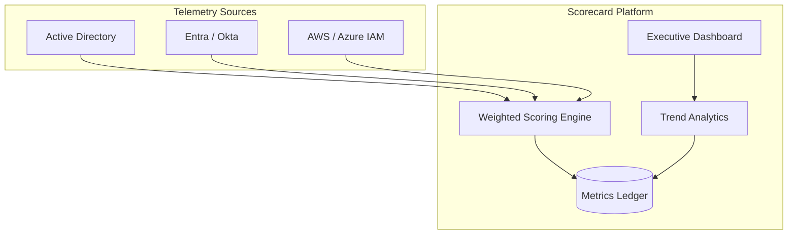

### 2. Hybrid Identity Telemetry Topology
Mapping telemetry from on-prem to multi-cloud scorecards.

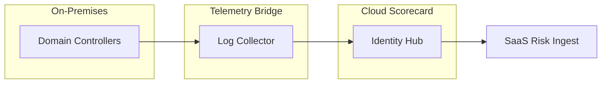

### 3. Weighted Risk Scoring Model
How different metrics contribute to the final security score.

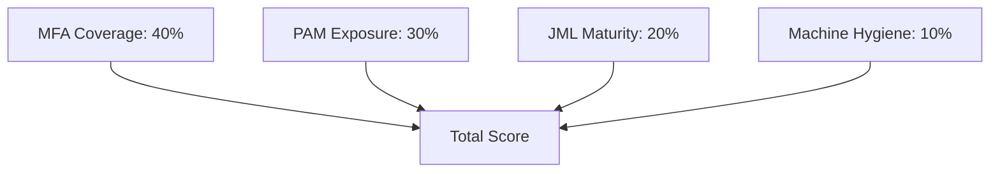

### 4. Zero Trust Maturity Roadmap
The journey from "Legacy" to "Optimized" Zero Trust.

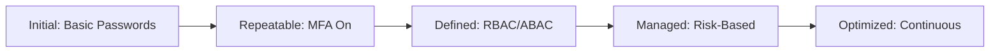

### 5. Benchmark Comparison Model
Comparing security posture across global business units.

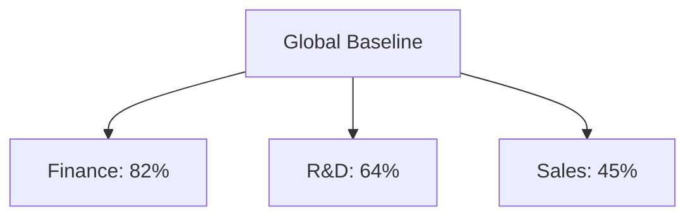

### 6. Remediation Tracking Workflow
Closing the loop between risk detection and resolution.

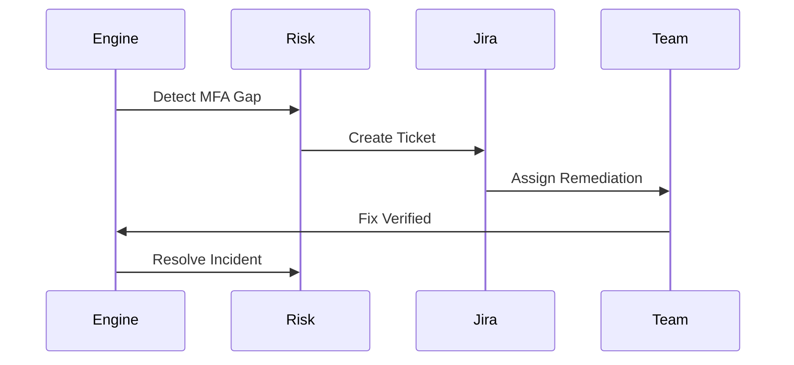

### 7. Dormant Account Lifecycle Risk
Visualizing the risk of "Identity Ghosts."

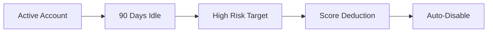

### 8. Privileged Access Sprawl Model
Measuring the expansion of administrative permissions.

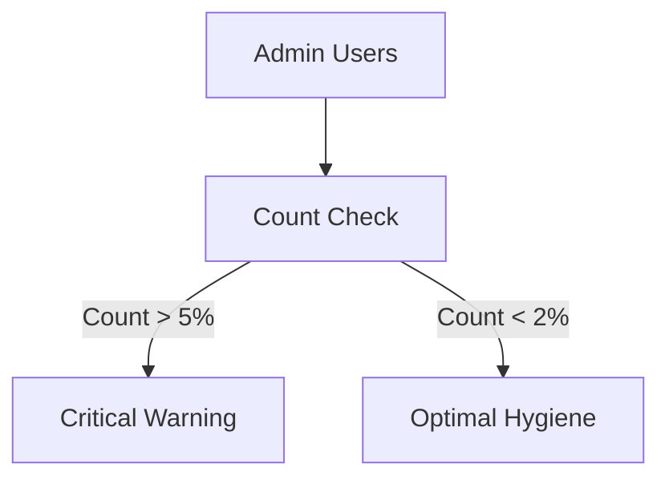

### 9. Machine Identity Expiry Risk
Predicting outages caused by expired non-human credentials.

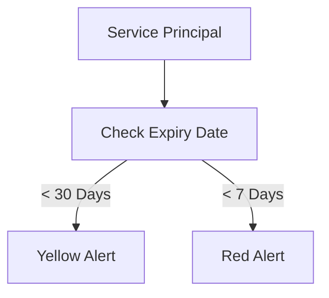

### 10. Board Reporting Cycle
The process of strategic communication.

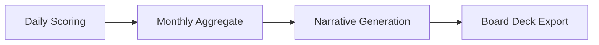

### 11. Workforce Risk Scoring Lifecycle
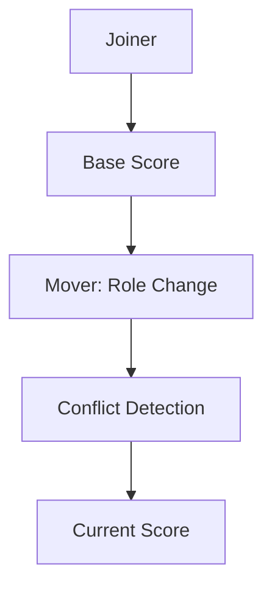

### 12. MFA Decision Posture Flow
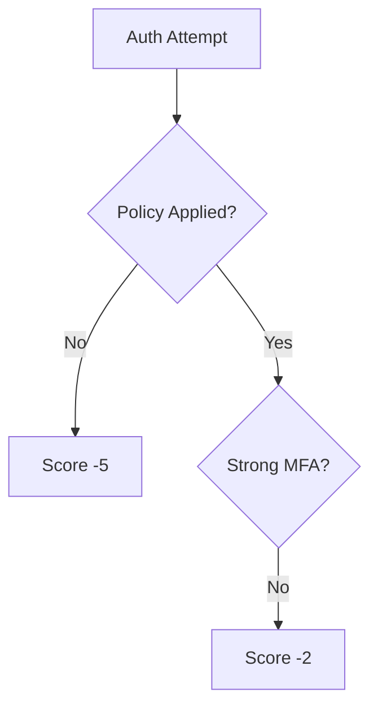

### 13. Maturity Heatmap Logic
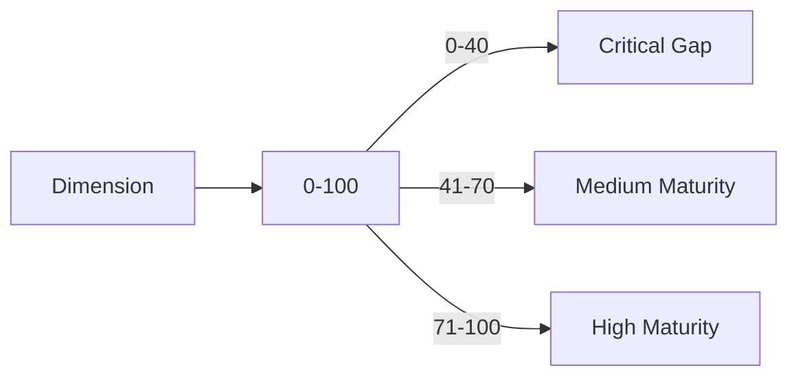

### 14. Identity Sync Worker Architecture
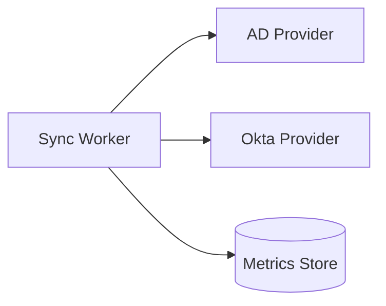

### 15. API Architecture Model
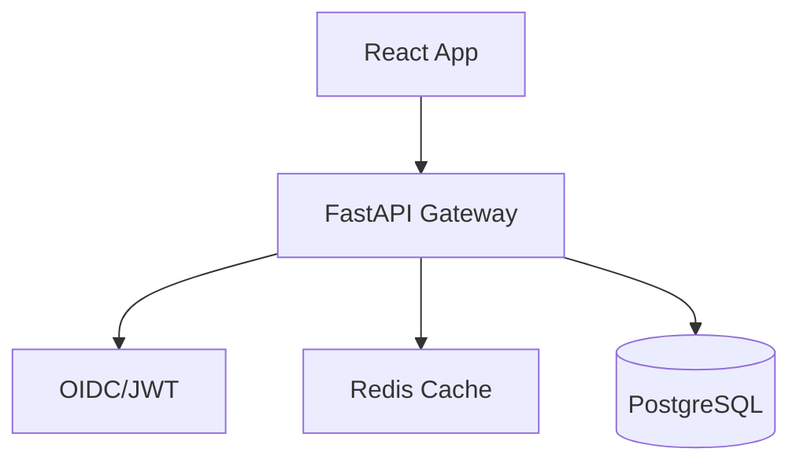

### 16. OIDC Authentication Flow
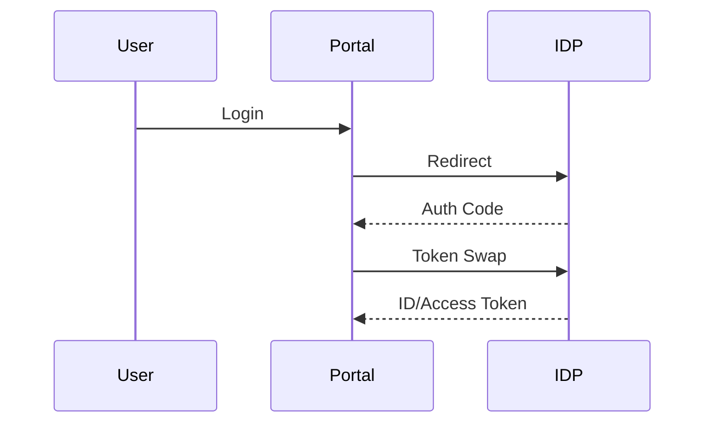

### 17. Segregation of Duties (SoD) Score
```mermaid
graph LR
    RoleA[Approve Pay] + RoleB[Create Pay] --> Toxic[Toxic Combo]
    Toxic --> Impact[Impact: Critical Score]
```

### 18. Conditional Access Effectiveness
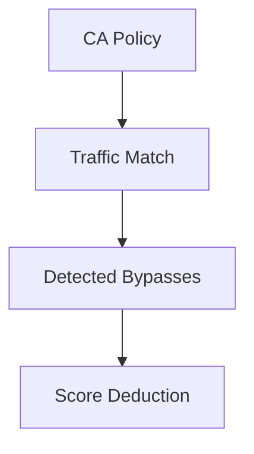

### 19. SaaS Entitlement Sprawl
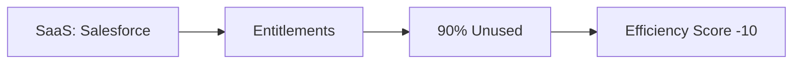

### 20. Directory Hygiene Index
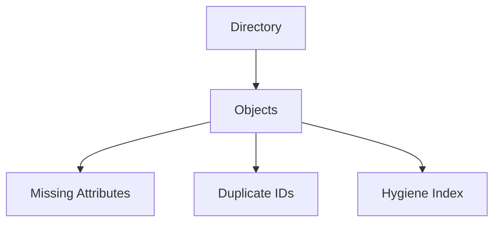

### 21. Cloud IAM Multi-Region Risk
```mermaid
graph TD
    AWS[AWS IAM] --> Reg1[Region US]
    AWS --> Reg2[Region EU]
    Reg1 + Reg2 --> Global[Global IAM Score]
```

### 22. ServiceNow Integration Flow
```mermaid
graph LR
    Score[Low Score] --> Trigger[Automation Trigger]
    Trigger --> SNOW[ServiceNow Incident]
```

### 23. Historical Trend Regression
```mermaid
graph LR
    P[Past Scores] --> ML[Regression Model]
    ML --> F[Forecast Score]
```

### 24. Audit Evidence Export Pipeline
```mermaid
graph TD
    Audit[Auditor Request] --> Filter[Select Evidence]
    Filter --> Export[Generate Signed PDF]
```

### 25. Risk Heatmap Matrix
```mermaid
graph TD
    Likelihood[High/Low] --> Impact[High/Low]
    Impact --> Matrix[4x4 Matrix]
```

### 26. PowerBI Data Model
```mermaid
graph LR
    SQL[PostgreSQL] --> ETL[Extract/Transform]
    ETL --> PBI[PowerBI Dataset]
```

### 27. Machine ID Certificate Flow
```mermaid
graph TD
    C[Cert] --> I[Issue]
    I --> V[Verify]
    V --> E[Expiry Monitor]
```

### 28. Identity Analytics UEBA
```mermaid
graph LR
    Logs[Log Stream] --> UEBA[Behavior Model]
    UEBA --> Score[Risk Score Delta]
```

### 29. Regional DR Topology
```mermaid
graph LR
    P[Primary US] <->|Replication| S[Secondary EU]
```

### 30. Strategic Roadmap Cycle
```mermaid
graph TD
    Score[Current Score] --> Plan[Remediation Plan]
    Plan --> Exec[Execute]
    Exec --> Rescore[New Score]
```

---

## 🛠️ Technical Stack & Deployment

### Local Development
To simulate the scorecard engine locally:
```bash
# Clone the repository
git clone https://github.com/devopstrio/identity-security-scorecard.git
cd identity-security-scorecard

# Setup environment
cp .env.example .env

# Start platform services
make up
```
Access the Metrics Portal at `http://localhost:3000`.

---

## 📜 License
Distributed under the MIT License. See `LICENSE` for more information.
