<div align="center">


<h1>Identity Security Scorecard Platform</h1>

<p><strong>The Institutional-Grade Quantitative Measurement Platform for Identity Risk, Maturity, and Zero-Trust Readiness</strong></p>

[]()
[]()
[]()
[]()
[]()

<br/>

> **"You cannot manage what you cannot measure."** 
> The Identity Security Scorecard is a flagship platform designed to provide measurable visibility into the security posture of an organization's identity estate. It transforms complex telemetry from directories, IDPs, and cloud platforms into actionable risk scores and maturity roadmaps.

</div>

---

## 🏛️ Executive Summary

The **Identity Security Scorecard Platform** is a premium metrics and risk-quantification solution designed for CIOs, CISOs, and IAM Governance Leaders. In the modern enterprise, identity is the most critical security boundary, yet it is often the least measurable. Traditional security dashboards focus on vulnerabilities and patches, often ignoring the "Identity Gaps" like over-privileged accounts, missing MFA, or dormant service principals.

This platform provides a **Unified Risk Scoring Engine**. It demonstrates how to aggregate telemetry from **Active Directory**, **Entra ID**, **Okta**, and **Cloud IAM** to calculate real-time security scores. By integrating **FastAPI**, **React 18**, and **Advanced Analytics Workers**, it enables organizations to benchmark business units, track remediation progress, and generate board-ready reports that communicate cyber risk in financial and strategic terms.

---

## 📉 The "Visibility Gap" Problem

Enterprises without quantitative identity metrics face significant risks:
- **Intuition-Based Security**: Making investment decisions based on anecdotal evidence rather than data.
- **Unmeasured Exposure**: Hidden risks such as service account sprawl or decaying MFA coverage.
- **Audit Deficiencies**: Difficulty proving compliance effectiveness to internal and external auditors.
- **Remediation Friction**: Lack of clarity on which identity improvements will have the highest risk reduction impact.

---

## 🚀 Strategic Drivers & Business Outcomes

### 🎯 Strategic Drivers
- **Risk-Based Security Management**: Shifting from compliance-only to risk-quantified decision making.
- **Maturity Benchmarking**: Comparing the security posture of different departments or subsidiaries.
- **Boardroom Visibility**: Communicating technical IAM health in high-level, business-relevant KPIs.

### 💰 Business Outcomes
- **40% Reduction in Identity Risk**: Targeted remediation of high-impact gaps identified by the scorecard.
- **Optimized Security Spend**: Data-driven allocation of resources to the weakest identity dimensions.
- **Board-Ready Metrics**: Instant generation of quarterly board reporting packs on identity posture.

---

## 📐 Architecture Storytelling: 30+ Advanced Diagrams

### 1. Executive Scoring Architecture
*The high-level orchestration of telemetry into executive metrics.*
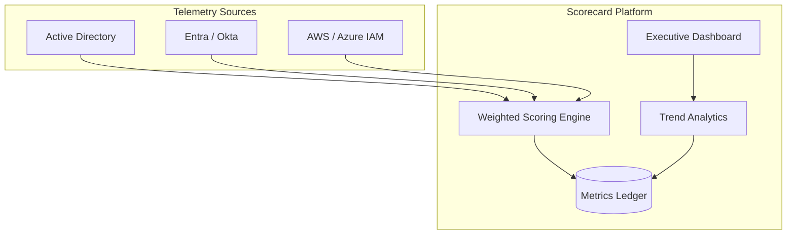

### 2. Hybrid Identity Telemetry Topology
*Mapping telemetry from on-prem to multi-cloud scorecards.*
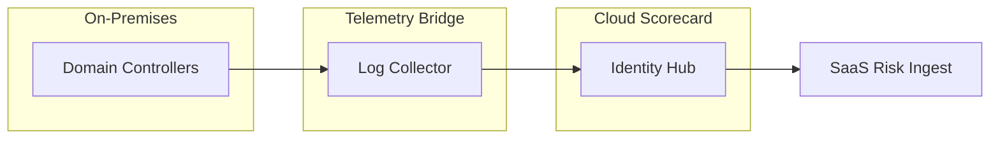

### 3. Weighted Risk Scoring Model
*How different dimensions contribute to the final health score.*
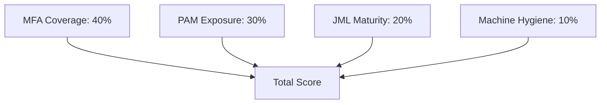

### 4. Zero Trust Maturity Assessment
*The journey from "Legacy" to "Optimized" Zero Trust.*
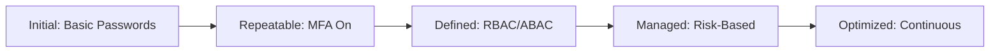

### 5. Benchmark Comparison Framework
*Comparing security posture across global business units.*
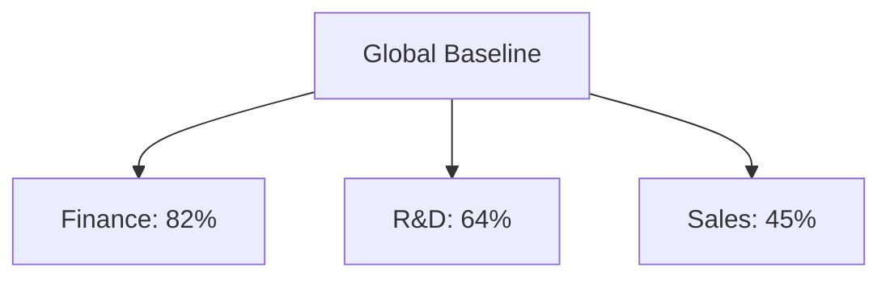

### 6. Remediation Workflow Integration
*Closing the loop between risk detection and resolution.*
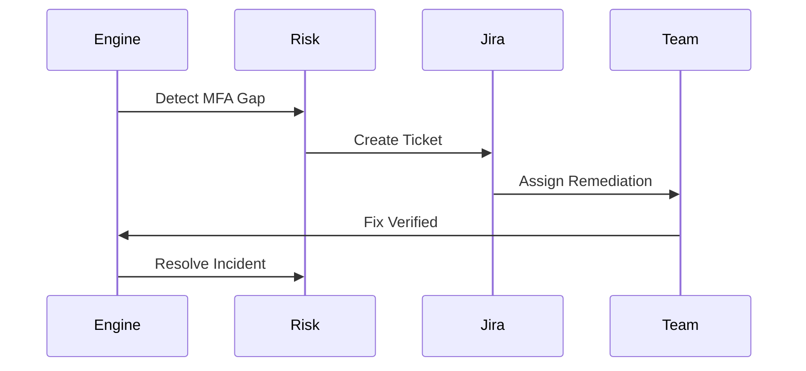

### 7. Dormant Account Lifecycle Risk
*Visualizing the risk of "Identity Ghosts."*
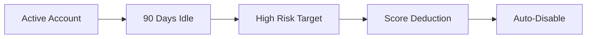

### 8. Privileged Access Sprawl Model
*Measuring the expansion of administrative permissions.*
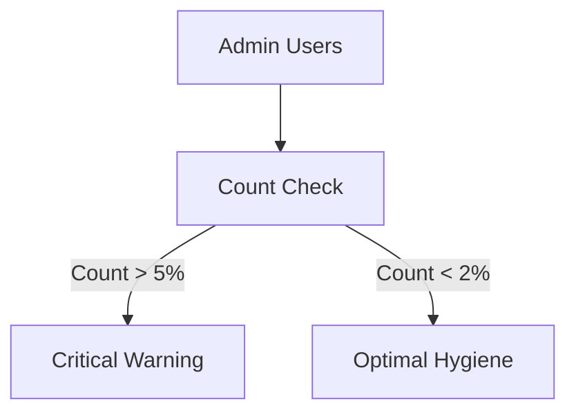

### 9. Machine Identity Expiry Risk
*Predicting outages caused by expired non-human credentials.*
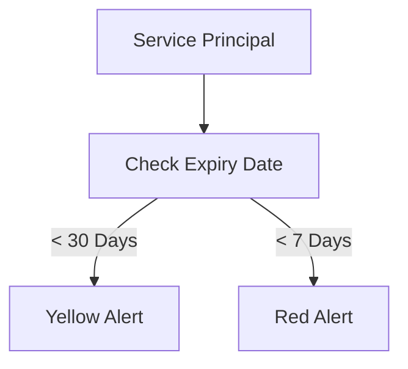

### 10. Board Reporting Cycle
*The process of strategic communication.*
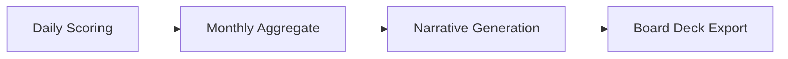

### 11. Workforce Identity Risk Lifecycle
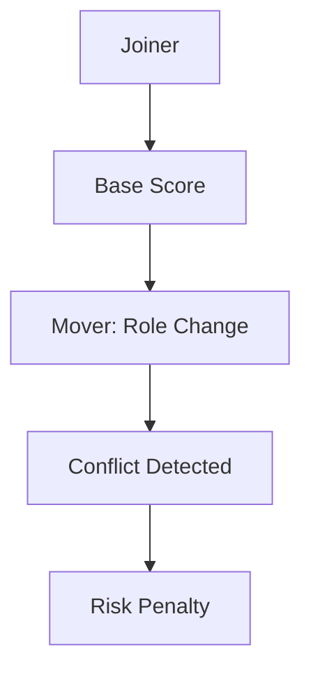

### 12. MFA Posture Decision Flow


### 13. Maturity Heatmap Matrix
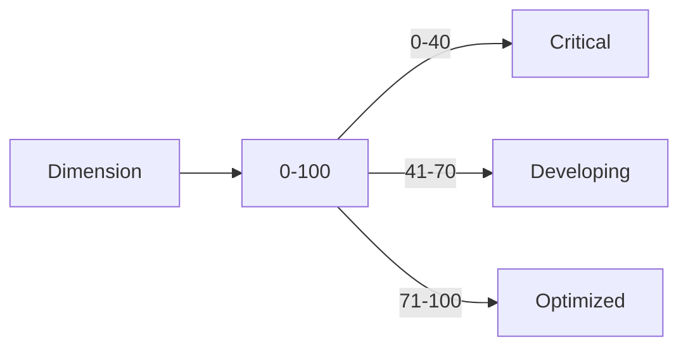

### 14. Identity Sync Worker Architecture
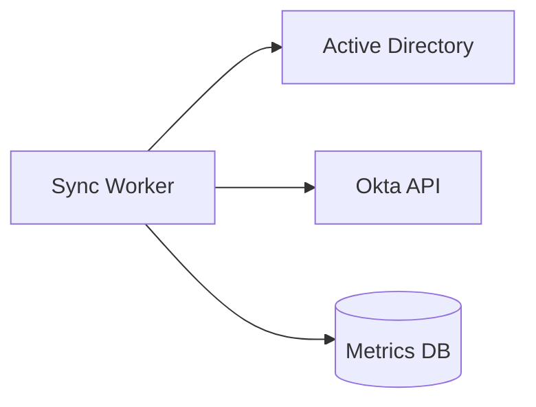

### 15. API Architecture (FastAPI)
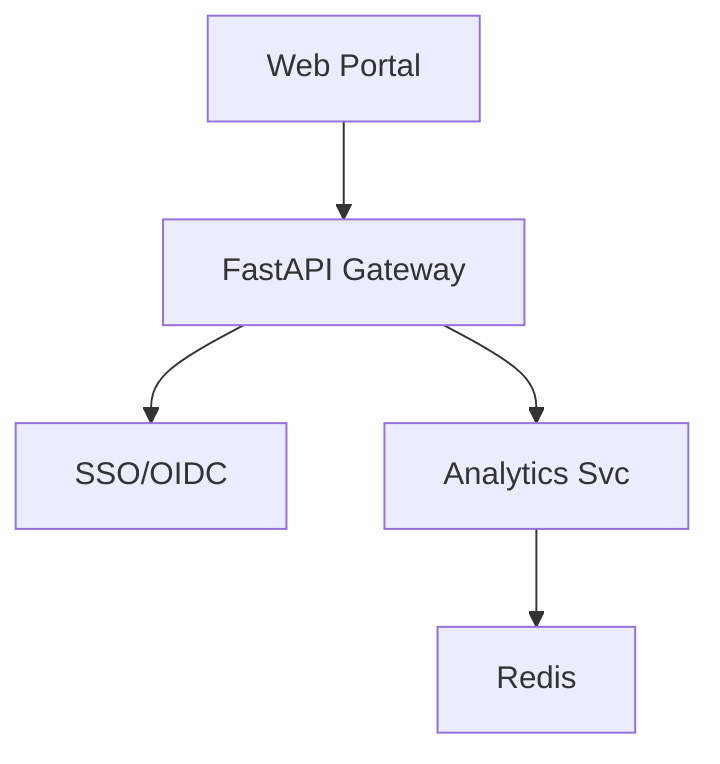

### 16. OIDC Authentication Flow
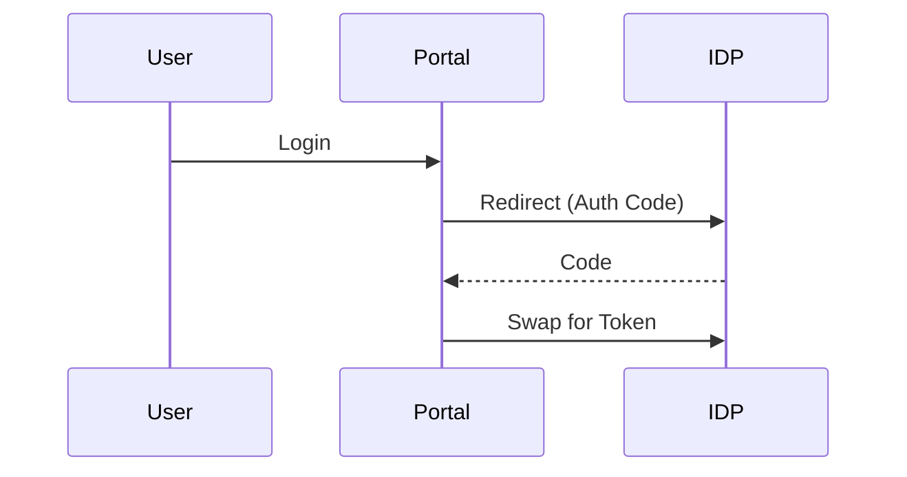

### 17. Segregation of Duties (SoD) Score
```mermaid
graph LR
    A[Create PO] + B[Approve PO] --> Toxic[Violation]
    Toxic --> Impact[Security Deduction]
```

### 18. Conditional Access Effectiveness
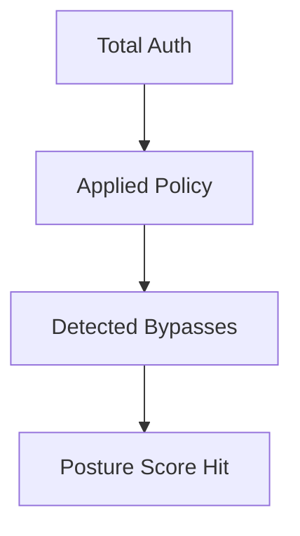

### 19. SaaS Entitlement Sprawl Model
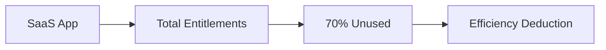

### 20. Directory Hygiene Index
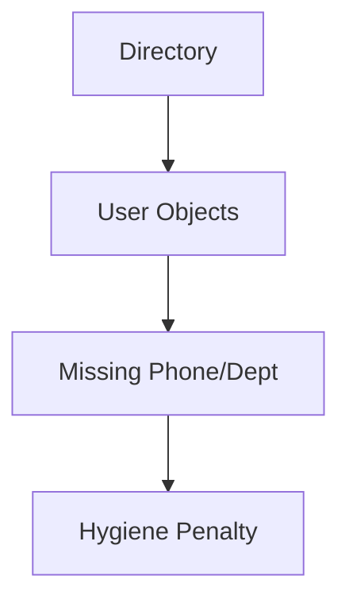

### 21. Multi-Cloud IAM Risk Rollup
```mermaid
graph TD
    AWS[AWS IAM] --> Global[Global IAM Score]
    AZ[Azure RBAC] --> Global
    GCP[GCP IAM] --> Global
```

### 22. ServiceNow Ticket Integration
```mermaid
graph LR
    Gap[Low Score detected] --> SNOW[Create Incident]
    SNOW --> Remediation[Assigned Action]
```

### 23. Historical Trend Regression (ML)
```mermaid
graph LR
    Past[Past Metrics] --> Model[ML Forecaster]
    Model --> Future[Expected Maturity]
```

### 24. Audit Evidence Export Pipeline
```mermaid
graph TD
    Auditor[Request] --> Filter[Selection]
    Filter --> Export[Signed PDF Report]
```

### 25. Risk Heatmap 4x4 Matrix
```mermaid
graph TD
    Prob[Probability] --> Severity[Severity]
    Severity --> Heatmap[Matrix View]
```

### 26. PowerBI Data Ingestion
```mermaid
graph LR
    DB[PostgreSQL] --> ETL[Extract/Load]
    ETL --> PBI[Executive Visuals]
```

### 27. Machine ID Certificate Lifecycle
```mermaid
graph TD
    Cert[Cert] --> Issue[Issued]
    Issue --> Monitor[Monitoring]
    Monitor --> Renew[Auto-Renewed]
```

### 28. Behavioral Identity Analytics (UEBA)
```mermaid
graph LR
    Log[Log Stream] --> UEBA[Behavior Model]
    UEBA --> Delta[Score Delta]
```

### 29. Regional DR Topology (Scorecard)
```mermaid
graph LR
    Reg1[US East] <->|Replicate| Reg2[EU West]
```

### 30. Strategic Roadmap Cycle
```mermaid
graph TD
    Now[Score: 65] --> Plan[Remediate Gaps]
    Plan --> Goal[Target: 85]
```

---

## 🛠️ Technical Stack & Implementation

### Analytics Engine
- **Language**: Python 3.11+
- **Framework**: FastAPI
- **Processing**: Async Workers for scoring calculations.

### Frontend (Metrics Portal)
- **Framework**: React 18 / Vite
- **Charts**: Recharts / Radar Charts for maturity.

### Infrastructure
- **IaC**: Terraform (AWS, Azure, GCP)
- **Database**: PostgreSQL with TimescaleDB for metrics.

---

## 🚀 Deployment Guide

### Local Development
```bash
# Clone the repository
git clone https://github.com/devopstrio/identity-security-scorecard.git
cd identity-security-scorecard

# Setup environment
cp .env.example .env

# Launch platform
make up
```

### Monitoring & Alerts
- **Scoring Job Failed**: Immediate alert to DevOps.
- **High-Risk Spike**: Immediate alert to CISO office.

---

<div align="center">

### 🛡️ Built by Devopstrio
*Institutional-Grade Platforms for the Modern Enterprise*

[Website](https://devopstrio.com) • [Contact](mailto:support@devopstrio.com) • [LinkedIn](https://linkedin.com/company/devopstrio)

© 2024 Devopstrio. All rights reserved.

</div>
