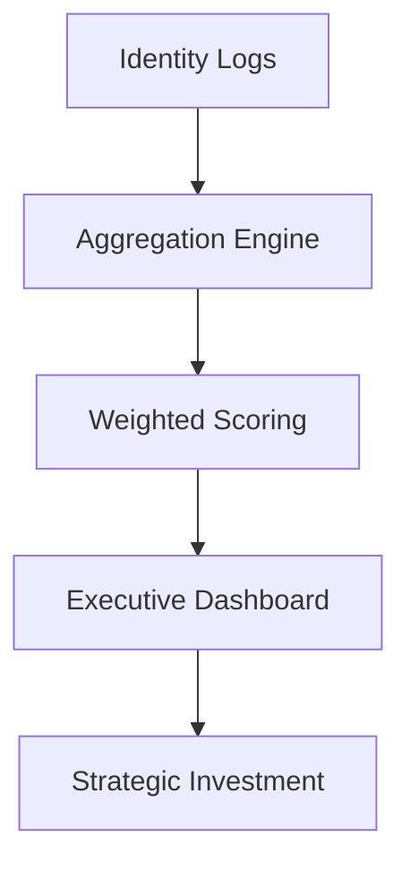
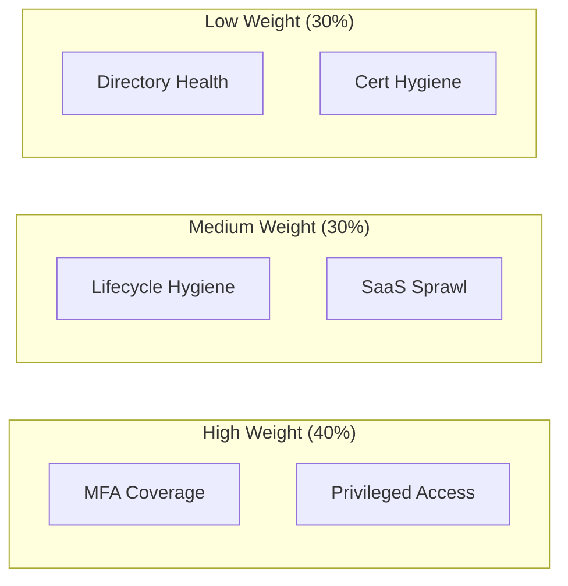
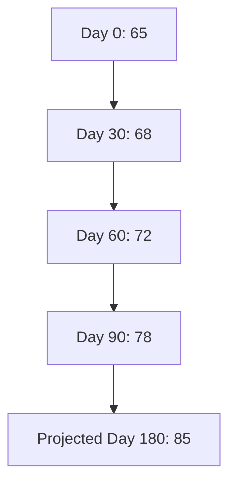

# Scorecard & Metrics Diagrams

## 11. Executive KPI Flow
*The journey from raw data to strategic decision-making.*

```mermaid
graph TD
    Data[Identity Logs] --> Agg[Aggregation Engine]
    Agg --> Weight[Weighted Scoring]
    Weight --> Dash[Executive Dashboard]
    Dash --> Decision[Strategic Investment]
```

## 13. Weighted Scoring Model (Deep Dive)

```mermaid
graph LR
    subgraph "High Weight (40%)"
        MFA[MFA Coverage]
        PAM[Privileged Access]
    end
    subgraph "Medium Weight (30%)"
        JML[Lifecycle Hygiene]
        SaaS[SaaS Sprawl]
    end
    subgraph "Low Weight (30%)"
        Dir[Directory Health]
        Cert[Cert Hygiene]
    end
```

## 15. Trend Analysis Model

```mermaid
graph TD
    T0[Day 0: 65] --> T30[Day 30: 68]
    T30 --> T60[Day 60: 72]
    T60 --> T90[Day 90: 78]
    T90 --> Proj[Projected Day 180: 85]
```
