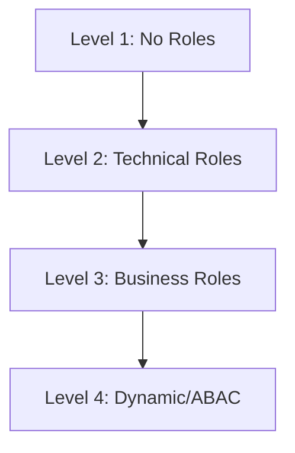
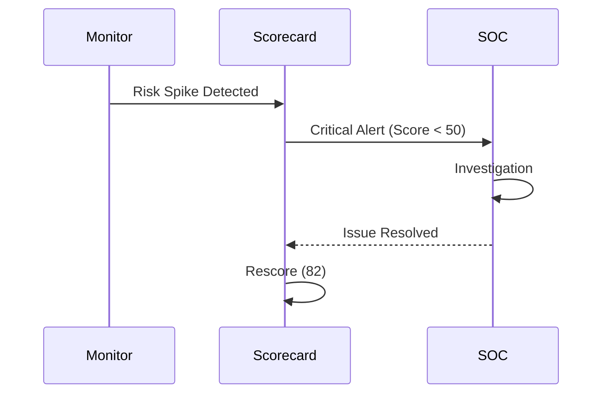
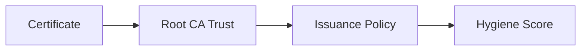

# Security & Integration Diagrams

## 22. RBAC Maturity Model

```mermaid
graph TD
    M1[Level 1: No Roles] --> M2[Level 2: Technical Roles]
    M2 --> M3[Level 3: Business Roles]
    M3 --> M4[Level 4: Dynamic/ABAC]
```

## 25. Incident Remediation Flow

```mermaid
sequenceDiagram
    participant Monitor
    participant Scorecard
    participant SOC
    Monitor->>Scorecard: Risk Spike Detected
    Scorecard->>SOC: Critical Alert (Score < 50)
    SOC->>SOC: Investigation
    SOC-->>Scorecard: Issue Resolved
    Scorecard->>Scorecard: Rescore (82)
```

## 40. Machine Identity Trust Model

```mermaid
graph LR
    Cert[Certificate] --> Root[Root CA Trust]
    Root --> Policy[Issuance Policy]
    Policy --> Score[Hygiene Score]
```
